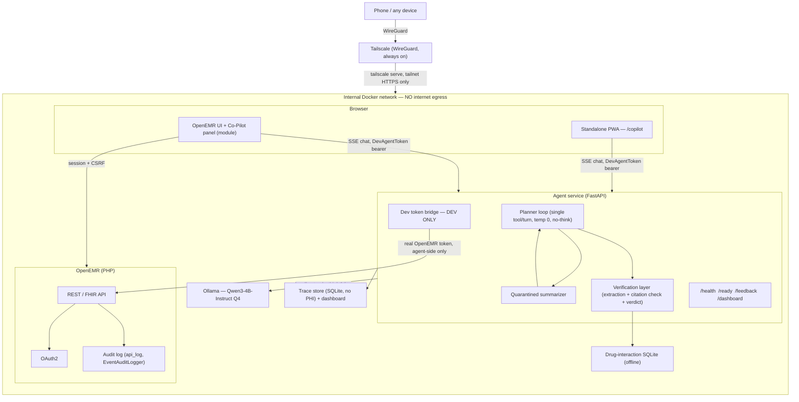

# Clinical Co-Pilot (on OpenEMR)

> An AI co-pilot embedded in OpenEMR that answers questions about the open
> chart — locally, with every claim re-checked against the record before it
> reaches a clinician.

<!-- TODO (owner, part of P5.6): record demo GIF, 60-90s of UC2 — a
     physician asks "what meds is she on?", the answer streams in, then a
     verified/partially_verified/blocked badge and tappable citation chips
     appear, each chip revealing the record value it was checked against. -->

> 🎬 **Demo GIF: not yet recorded** — will show UC2 (medication safety) end
> to end: a physician asks "what meds is she on?", the answer streams in,
> then a `verified` / `partially_verified` / `blocked` badge and tappable
> citation chips appear, each chip revealing the record value the claim was
> checked against.

📋 **[Project board (live plan)](https://github.com/users/franciszver/projects/2)**
· 📐 [Architecture](docs/ARCHITECTURE.md)
· 🔒 [Security audit](docs/AUDIT.md)
· 🧭 [Developer's guide](docs/DEVELOPERS_GUIDE.md)
· 🧪 [Test plan](docs/TEST_PLAN.md)
· 📄 [Implementation plan](docs/IMPLEMENTATION_PLAN.md)

**The thesis:** a small model that runs entirely on your own hardware, paired
with a deterministic verification layer that independently re-checks every
factual claim against the record, beats a bigger cloud model you're asked to
blindly trust with patient data. PHI never leaves the machine — there's no
outbound network path for the model or the agent to leak it through, and
nothing to send to a cloud vendor in the first place.

---

[](https://github.com/franciszver/agentforge-1-clinical-copilot/actions/workflows/copilot-ci.yml)

---

## What it does

A physician has a patient's chart open in OpenEMR and asks a question in
plain language — "what changed since her last visit?", "what is she taking,
and does anything conflict with ibuprofen?", "what were her last three A1c
values?". The agent answers from the patient's own record, and every factual
claim in the answer carries a citation back to the exact tool result it came
from. A deterministic, non-LLM checker re-validates each citation against the
raw record value before the response ever renders — a claim that doesn't
check out is stripped and replaced with an honest "not found in record"
notice, never silently passed through.

It works two ways: a panel embedded directly in the OpenEMR UI, and a
standalone installable PWA at `/copilot` for the same chat experience on a
phone, reachable over Tailscale from anywhere without opening a public port.

The five use cases the project is built around — pre-visit brief, medication
safety, lab trend recall, conversational follow-up, and the mobile "hallway"
version of all four — are described in full, with the physician's own words
and why an agent (not just a better dashboard) is needed, in
[`docs/USERS.md`](docs/USERS.md).

## Architecture



Five pieces: **OpenEMR** stays the system of record for patient data, the
REST/FHIR API, OAuth2, and the audit trail — the Co-Pilot reads through
OpenEMR's own authorization, never around it. The **FastAPI agent service**
runs the planner loop and the verification layer. **Ollama** serves
Qwen3-4B-Instruct locally, reachable only from the agent container. A
**drug-interaction SQLite** database and a **trace store** (no PHI on disk)
round it out. Every component that touches PHI sits on a single internal
Docker network with no route to the public internet — enforced by network
configuration, not policy — and remote access exists only through
Tailscale's WireGuard mesh.

Full design detail — the verification pipeline, trust boundaries, the honest
gaps, and the path to a production auth model — is in
[`docs/ARCHITECTURE.md`](docs/ARCHITECTURE.md).

## Quickstart

The dev compose overlay reserves an NVIDIA GPU for Ollama, so this quickstart
targets a machine with an NVIDIA GPU and the NVIDIA Container Toolkit
installed (see [hardware expectations](#local-model-pros-and-cons--hardware-expectations)
below). It's honestly more than 3 commands — the model has to be pulled into
a volume, and the agent needs a one-time dev auth bootstrap before it can
fetch real clinical data — but each step is one command and the whole thing
runs unattended.

```bash
# 1. Bring up OpenEMR + the Co-Pilot overlay (agent + Ollama), demo patients included
cd docker/development-easy
docker compose -f docker-compose.yml -f docker-compose.copilot.yml up -d

# 2. Pull the local model into the Ollama volume (one-time; several minutes)
cd ../..
bash scripts/pull-model.sh

# 3. Bootstrap the agent's dev token bridge so it can fetch real chart data
bash scripts/bootstrap-copilot-dev-client.sh
```

Then:

4. Log in to OpenEMR at **http://localhost:8300/** (or **https://localhost:9300/**)
   as `admin` / `pass`. `DEMO_MODE=standard` loads the demo patient panel
   automatically on first boot.
5. Enable the module: **Modules → Manage Modules**, find **Clinical Co-Pilot
   Agent**, register and enable it. The chat panel then appears on the
   patient dashboard; the same experience is also installable standalone at
   **`/copilot`**.

For the full dev-stack setup (worktrees, `openemr-cmd`, test commands),
see [`CONTRIBUTING.md`](CONTRIBUTING.md) and
[`docs/DEVELOPERS_GUIDE.md`](docs/DEVELOPERS_GUIDE.md).

## Local-model pros and cons + hardware expectations

**Why local:** nothing about a patient's chart — the question asked, the
tool results fetched, the answer generated — ever crosses the internal
Docker network's boundary. There's no cloud API call to audit, no vendor
data-processing agreement to negotiate, and no PHI transit to secure,
because there's no egress path to revoke in the first place. That property
holds by network configuration, not by policy.

**The cost of local:** a 4B-parameter model asked a clinical question will
occasionally hallucinate or mis-cite something, which is exactly why the
verification layer exists — every claim is independently re-checked against
the raw record, and a claim that doesn't hold up is stripped rather than
shown. On structured record data the combination works well: a measurement
spike found the model's citations check out 100% of the time across all
four use cases once one targeted fix (EAV-to-wide-format normalization) went
in. It does **not** extend to free-text clinical reasoning — an answer that
infers or synthesizes rather than reporting a stored value produces few or
no checkable citations, and the verifier is deliberately fail-closed there
(`blocked`, not a softer "can't check" signal). The eval suite's honest
result is **25 of 31 cases pass, 6 are documented `xfail`s** (0.8065) —
ambiguity resolution, recency judgment, and a cross-patient prose
misattribution gap are measured, tracked failure modes, not hidden ones. See
[Eval Results in `docs/ARCHITECTURE.md`](docs/ARCHITECTURE.md#eval-results-the-honest-number)
for the full breakdown.

**Hardware tiers** (from `docs/ARCHITECTURE.md` §TCO; priors unless noted):

| Tier | Model (Q4_K_M) | Expected speed | Notes |
|---|---|---|---|
| RTX 5060 Laptop 8GB (dev/demo) | Qwen3-4B | ~40–100+ tok/s | Workable for single-user interactive use; **measured to destabilize under sustained concurrent load** (Ollama container wedged and needed a host restart during one live eval run) — a real capacity ceiling, not yet formally quantified. |
| Raspberry Pi 5 8GB (CPU) | Llama 3.2 3B / Qwen3-4B | ~5–9 tok/s | Not benchmarked; expected to work only in a pre-generated "batch brief" mode (30–60s/answer), not live chat. The committed dev compose file also reserves an NVIDIA GPU device for Ollama, so a CPU-only tier needs that reservation removed before it will even start. |
| Flagship phone (on-device, future) | 3–4B via llama.cpp/MLC | ~10–15 tok/s | Industry-reported figure for this model class; not built or benchmarked in this project — today the phone is a Tailscale client to the server-side model, not a local-inference device. |

## Honest limitations

- **The dev-to-clinic auth gap is the biggest one.** The agent obtains
  OpenEMR access via a dev token bridge — a shared demo-clinician credential
  the agent itself uses for every tool call — rather than forwarding the
  actual logged-in user's own OAuth token. Patient-context binding still
  restricts which patient a conversation can touch, and that boundary holds
  under active testing, but per-user ACL differentiation (what a nurse's
  token can fetch vs. a physician's) is not exercised end-to-end today. This
  is scoped and tracked as [issue #124](https://github.com/franciszver/agentforge-1-clinical-copilot/issues/124),
  not silently deferred.
- **The model's prose can mislabel whose data it's describing.** A demand
  for a different patient's data never dispatches a cross-patient tool call
  and never leaks a marker value — the structural boundary holds — but the
  answer's *sentence* has, in testing, mislabeled the bound patient's own
  correctly-cited data as belonging to someone else. Tracked as
  [issue #121/#153](https://github.com/franciszver/agentforge-1-clinical-copilot/issues/121),
  kept as an honest `xfail` rather than weakened to match the wrong
  behavior.
- **Verification only covers claims about structured record data**, not
  free-text clinical reasoning — see the pros/cons section above.
- **The base OpenEMR platform has its own findings**, inherited by anything
  built on top of it: PHI stored unencrypted in `api_log`, a sensitivity ACL
  enforced in the UI but not on the REST/FHIR read path, and a permissive
  CORS policy, among others — each verified against a running instance, with
  remediation and the Co-Pilot's own compensating design noted per finding.
  See [`docs/AUDIT.md`](docs/AUDIT.md) for the full report, including the
  candidate findings that were investigated and did *not* reproduce.
- **This is a portfolio-scale, single-tenant deployment** on one developer's
  own hardware, not a production system — see "Path to Production" in
  `docs/ARCHITECTURE.md` for what a real deployment would still need (real
  per-user auth, BAA-covered hosting, TLS on every internal hop, PHI-at-rest
  encryption beyond the trace store).

## Credits

This project is built on [**OpenEMR**](https://open-emr.org), a free and
open source electronic health records and practice management system, via a
pruned import of [Gauntlet-HQ/openemr-base-clean](https://github.com/Gauntlet-HQ/openemr-base-clean).
OpenEMR is the platform this project extends, not something it replaces —
patient data, the REST/FHIR API, OAuth2, and the audit trail all remain
OpenEMR's. See [`CONTRIBUTING.md`](CONTRIBUTING.md) for the upstream
project's own contribution guide, support channels, and license.

The local-AI stack is [**Ollama**](https://ollama.com) serving
[**Qwen3**](https://github.com/QwenLM/Qwen) (4B-Instruct, Q4 quantization).

Licensed under the [GNU GPL](LICENSE), same as the OpenEMR base.
