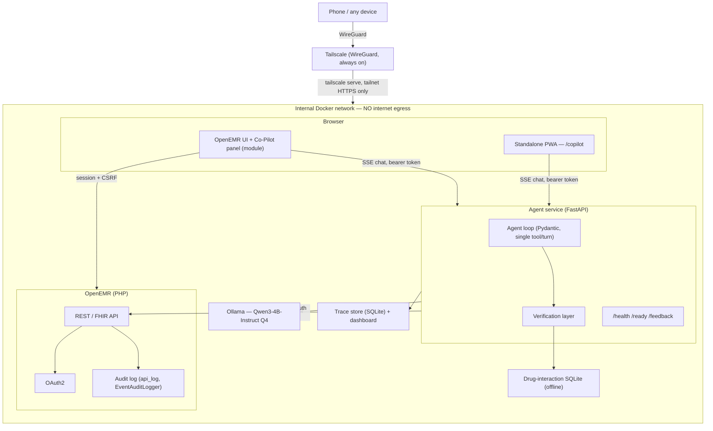
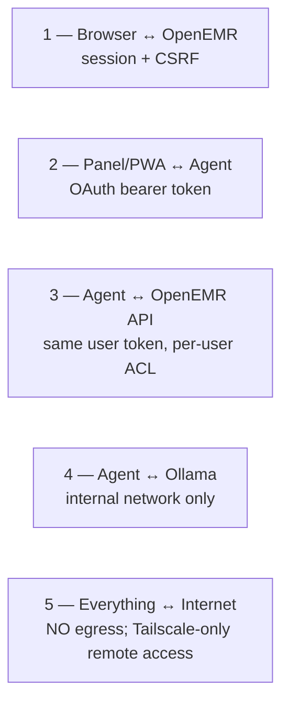

# Clinical Co-Pilot — Architecture

- **Status:** Phase 1 draft (P1.6). Diagram-first, trust boundaries, and key design
  decisions. The final pass — full verification-layer design, TCO / local-vs-cloud
  cost tiers, path to production, and the future mobile path — lands in Phase 5
  (P5.4). Sections below marked accordingly.
- **Related:** `docs/IMPLEMENTATION_PLAN.md` §4–5 (source of this draft),
  `docs/AUDIT.md` (security posture this design responds to), `docs/USERS.md`
  (persona and use cases this architecture serves).

## Summary

The Clinical Co-Pilot's architectural thesis is a bet against the industry
default: **a small local model paired with a deterministic verification layer
that independently re-checks every claim beats a big cloud model you blindly
trust.** A 4B-parameter model asked "does anything she's taking conflict with
ibuprofen?" will occasionally hallucinate a medication that isn't on the chart.
The fix in most AI-in-healthcare products is a bigger model and a disclaimer.
This project's fix is architectural: every factual claim the agent makes must
carry a citation back to a specific tool-call result, and a deterministic
(non-LLM) checker re-validates that citation against the cached record data
before the response ever reaches a clinician. A claim that fails verification
is stripped and replaced with an honest "not found in record" notice, not
silently passed through. Trust is earned per-claim, not assumed from model
scale.

The second half of the thesis is that this only works if the model runs where
the data lives. Every component that touches PHI — OpenEMR, the FastAPI agent,
the local Ollama runtime serving Qwen3-4B, the drug-interaction database, and
the trace store — sits on a single internal Docker network with no route to
the public internet. That property is enforced by network configuration, not
policy: the agent and inference containers have no egress path to revoke, so
there is no cloud API call to audit, no vendor DPA to negotiate, and no PHI
transit to secure. Remote access exists, because the physician's real
workflow happens away from a desktop — but it exists exclusively through
Tailscale's WireGuard mesh, which extends the same private network to an
authenticated device rather than opening a public port.

Structurally, the system has five pieces. **OpenEMR** is the system of record:
patient data, the REST/FHIR API, OAuth2, and the audit trail all belong to it,
and the Co-Pilot deliberately owns none of that — it reads through OpenEMR's
own authorization, never around it. A **browser module** embeds a chat panel
in the OpenEMR UI via Symfony render events, and a **standalone PWA** route
serves the same chat experience installable on a phone, because the 90-second
window between patients most often happens away from the workstation. The
**FastAPI agent service** holds the agent loop, the verification layer, and
the operational endpoints (`/health`, `/ready`, `/feedback`). **Ollama**
serves Qwen3-4B-Instruct locally, reachable only from the agent container.
And two small stores round it out: an offline **drug-interaction SQLite**
database that never leaves the box, and a **trace store** (also SQLite) that
records every request, tool call, and verification result for the
observability dashboard and the human-feedback loop.

None of this is presented as a finished production system — it is a
portfolio-scale, single-tenant deployment on a developer's own hardware,
reachable only by that developer's devices. What it demonstrates is a
verification-first pattern for trusting a small local model, and a trust
boundary discipline (no egress, user-token pass-through, patient-context
binding) that scales conceptually to a real deployment, detailed in the
Phase 5 final pass.

## Architecture Diagram

If this renders poorly, the equivalent ASCII diagram (`docs/IMPLEMENTATION_PLAN.md`
§4) is the fallback reference.

## Trust Boundaries

Five boundaries, carried over from `docs/IMPLEMENTATION_PLAN.md` §5 and
verified against the platform's actual behavior in `docs/AUDIT.md`:

1. **Browser ↔ OpenEMR** — the module rides OpenEMR's existing session and
   CSRF controls (`CsrfUtils::verifyCsrfToken()` on every AJAX call); the
   Co-Pilot adds no parallel session mechanism.
2. **Panel/PWA ↔ Agent** — the chat UI authenticates to the agent with an
   OpenEMR-issued OAuth bearer token over SSE. The agent validates it before
   opening a conversation.
3. **Agent ↔ OpenEMR API** — every tool call is made with *that user's*
   bearer token, never a service credential. OpenEMR's own ACL enforcement
   decides what comes back; the agent cannot fetch data its user isn't
   authorized to see. This boundary is why F-10 in `docs/AUDIT.md` matters
   directly (see below).
4. **Agent ↔ Ollama** — inference is reachable only from inside the Docker
   network; nothing outside the agent container can reach the model.
5. **Everything ↔ Internet** — the agent and Ollama containers have no
   egress route at all. Remote access is Tailscale-only: `tailscale serve`
   exposes the stack to the developer's own tailnet over WireGuard; nothing
   is bound to a public interface.

## Key Design Decisions

**Local-only inference, no egress.** Qwen3-4B runs on-box via Ollama with no
outbound network path for the agent or inference containers. This makes "PHI
never leaves the machine" a property of the Docker network configuration —
checkable by inspecting network definitions — rather than a policy statement
that has to be trusted. It also sidesteps BAA negotiation with a cloud model
vendor entirely, at the cost of a smaller model's raw reasoning ability,
which is what the verification layer exists to compensate for.

**User-token pass-through auth.** The agent never holds a service account
against OpenEMR. Every tool call carries the requesting clinician's own OAuth
token, so OpenEMR's existing ACL machinery is the actual enforcement point
(§4.2, `docs/IMPLEMENTATION_PLAN.md`). A nurse's token cannot pull data a
nurse's role wouldn't see in the UI — the agent has no separate privilege to
exploit.

**Patient-context binding.** `docs/AUDIT.md` finding **F-10** establishes
that OpenEMR's central REST/FHIR authorization is role- and resource-scoped,
not patient-scoped: a provider token with `user/*.read` can legitimately
fetch *any* patient's chart, because the platform's trust model treats an
authenticated provider as authorized to the whole clinic. That is standard,
intentional OpenEMR behavior, not a bug — but it means the base platform
gives the Co-Pilot no patient-granular boundary to lean on. The agent adds
one itself: every conversation is anchored to the `pid` the panel was opened
on, and the tool layer refuses any call for a different patient id, logging
the attempt. This is defense-in-depth narrowing on top of OpenEMR's role
enforcement, not a replacement for it — the production-grade version of this
boundary (SMART `patient/*.read` launch-context tokens, where the token
itself carries the patient scope) is deferred to the Phase 5 final pass.

**Deterministic verification layer (trust but verify).** The core response
to running a small model: every factual claim in a response is required to
carry a `source_refs` citation (tool-call id, record uuid, field), and a
non-LLM checker re-validates each citation against the cached tool output
from that conversation before the response is shown. Citations that fail —
missing, mismatched, or pointing at a call that never happened — are stripped
and replaced with an explicit "not found in record" notice rather than passed
through silently. Medication mentions are additionally cross-checked against
the patient's allergy list and run through an offline drug-interaction
database. The result is a `verified | partially_verified | blocked` verdict
attached to every response. Full design detail (citation-checker internals,
coverage targets, known limitations around free-text reasoning) is Phase 3
implementation and the Phase 5 architecture pass, not this draft.

**Hand-rolled observability.** A SQLite trace store plus a small FastAPI
dashboard, rather than a self-hosted observability platform. For a
single-node, single-tenant deployment, running a multi-container
observability stack (e.g. Langfuse) would outweigh the system it's
observing. Every request, tool call, LLM call, and verification event carries
a correlation id, which is enough to reconstruct any conversation end to end
from logs alone.

**Mobile-first / PWA.** The chat UI is designed 360px-first and served at two
URLs — embedded in the OpenEMR module and as a standalone installable
`/copilot` PWA — because the persona's actual working window (`docs/USERS.md`)
is mostly spent away from the workstation. The service worker caches static
assets only; API and chat routes are network-only, so no PHI ever enters
Cache Storage. Phones reach the stack exclusively over Tailscale.

## Drafted Here, Finalized in P5.4

This document establishes the shape of the system. The Phase 5 final pass
(`docs: ARCHITECTURE.md final + TCO`, P5.4) adds:

- **Full verification-layer design** — citation-checker algorithm detail,
  coverage methodology, and an honest accounting of what it cannot verify
  (free-text clinical reasoning, as opposed to structured-data claims).
- **TCO / local-vs-cloud cost tiers** — measured local inference cost
  (hardware amortization, energy/time) against comparable cloud-API pricing,
  informed by the Phase 5 capacity run (`docs/IMPLEMENTATION_PLAN.md` §7).
- **Path to production** — SMART patient-context launch tokens replacing the
  agent-side patient-context binding, high-availability considerations, and
  what a BAA-covered hosting environment would require that this local
  deployment does not.
- **Future mobile path** — the Capacitor app-store wrap and on-device
  inference options noted but not built in this phase.
